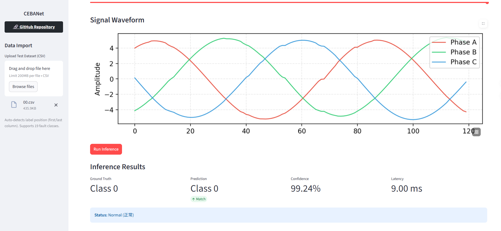
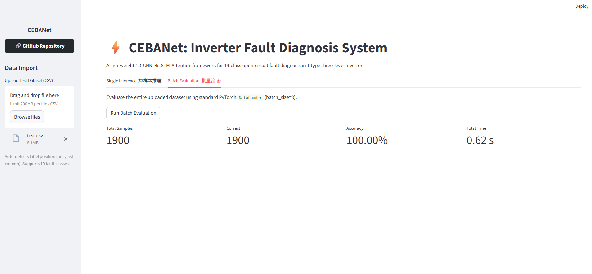

# ⚡ CEBANet-Inverter-Fault-Diagnosis-System
**基于深度学习的 T 型三电平逆变器智能故障诊断可视化系统**


本项目提供了一套基于数据驱动的 T 型三电平逆变器开路故障智能诊断开源解决方案。通过提出一种轻量级的 1D端到端深度融合网络 **CEBANet (1D CNN-BiLSTM-Attention-ECA)**，实现了对逆变器原始电气信号的直接特征提取，全面覆盖 **19 种** 复杂工况与开路故障的高精度分类。

配套的交互式 Web 可视化系统，打通了从理论算法、模型验证到工业级软件部署的完整工程闭环。

---

## ✨ 核心特性 (Key Features)

- **1D 端到端网络架构**：摒弃传统复杂的 2D 图像转换或手工特征提取工程，直接解析 1D 原始高频时序信号，计算效率大幅提升。
- **高精度多分类**：支持多达 19 种逆变器运行状态分类，涵盖正常状态、单管开路故障以及复杂的双管复合开路故障。
- **极致轻量化部署**：引入 ECA (Efficient Channel Attention) 机制并优化时空网络结构，大幅降低模型参数量，满足工业嵌入式控制器的资源限制。
- **自适应数据解析 UI**：系统自动侦测混合测试集或单分类数据的标签位置，支持单样本波形特征重构与全数据集并发验证，毫秒级输出诊断置信度。

---

## 📊 系统演示 (System UI)

### 1. 单样本可视化与精密诊断面板


### 2. 工业级全量并发测试与准确率评估报告


---

## 🚀 快速启动 (Quick Start)

### 1. 环境依赖配置
请确保您的计算机已安装 Python 3.8+。在终端执行以下命令安装核心依赖：
```bash
pip install torch pandas numpy matplotlib streamlit
```

### 2. 获取代码与预训练权重
将本仓库克隆到本地计算机：
```bash
git clone [https://github.com/keyandishou/Inverter-Fault-Diagnosis.git](https://github.com/keyandishou/Inverter-Fault-Diagnosis.git)
cd Inverter-Fault-Diagnosis
```
*(注：请确保已将训练好的权重文件 `CNN7.pth` 放置于项目根目录下)*

### 3. 启动 Web 可视化诊断系统
```bash
streamlit run app.py
```
运行后，浏览器将自动打开交互界面 `http://localhost:8501`。请在左侧边栏上传附带的测试数据集（如 `04.csv` 或 `test.csv`）进行系统体验。

---

## 🛠️ 二次开发与代码适配指南 (How to Modify & Adapt)

本系统的推理部署架构具备高度的**可移植性与可扩展性**。如果您是一位研究电机故障、轴承诊断、齿轮箱监测或电网信号分析的同行，您可以非常轻易地将本框架应用于您的专属模型：

### 🔧 1. 适配您自己的分类任务 (修改分类数)
本系统默认针对逆变器的 19 种状态进行分类。如果您的任务是 5 分类或 10 分类：
- 打开 `app.py`，定位到 `load_model()` 函数。
- 将 `model = CNN_LSTM_Attention(num_classes=19)` 中的 `19` 修改为您实际的类别数量。
- 在 `app.py` 中找到 `FAULT_DICT` 字典，修改对应的状态映射（如 `0: "正常", 1: "内圈故障"...`），Web 界面将自动同步显示您的专属标签。

### 🔧 2. 调整时序信号窗口长度与通道数 (修改数据维度)
本项目默认的输入特征是一维数组，总长度为 **360**（3 个电气通道拼接，每个通道截取 120 个采样点）。如果您的数据采样点长度不同：
- 打开 `app.py`，找到 `if len(feat) == 360:`。将其改为您的实际一维特征长度（例如 `200`）。
- 同步修改波形绘制逻辑中的切片跨度。例如，如果您是单通道数据长度 200，将画图代码精简为一行 `ax.plot(feat[0:200], label="Sensor Data")`。
- **底层逻辑**：送入模型的维度是通过 `input_data = x_tensor[idx].unsqueeze(0).unsqueeze(0)` 实现的，这会构建标准的 `(Batch=1, Channel=1, Length)` 张量。只要您的信号是 1D 时序序列，模型首层的 `Conv1d` 就能自适应提取特征。

### 🔧 3. 升级或替换核心深度学习模型
如果您想测试其他网络（如 ResNet, Transformer 等），无需修改 Web 前端逻辑：
- 直接打开 `model20.py` 文件。
- 重写或修改里面的 `CNN_LSTM_Attention` 类。您可以自由更改 `Conv1d` 的卷积核大小 (`kernel_size`)，或者移除 `LSTM` 模块。
- 只要保证模型的 `forward(self, x)` 输入是 `(Batch, 1, Length)` 且输出是 `(Batch, num_classes)`，`app.py` 就会无缝接管您的新模型并完成可视化。

### 🔧 4. 替换预训练权重文件
当您完成自己的模型训练后，将新的 `.pth` 权重文件放入项目根目录，并在 `app.py` 中修改读取路径即可：
```python
# 在 app.py 的 load_model() 函数中修改：
model.load_state_dict(torch.load("your_new_weights.pth", map_location=device))
```

---

## 📁 目录结构 (Directory Structure)

```text
├── app.py                  # Streamlit Web 系统前端与推理中枢
├── model20.py              # CEBANet 深度网络架构源码
├── CNN7.pth                # 预训练模型权重 (部署必须项)
├── data/
│   ├── test.csv            # 19分类混合测试集 Demo
│   └── 04.csv              # 单分类故障测试集 Demo
└── README.md               # 项目使用说明文档
```

---

## 📧 联系方式 (Contact)
本项目由 **[keyandishou](https://github.com/keyandishou)** 独立开发与维护。
如您在代码复现、算法探讨或工业落地交流方面有任何疑问，欢迎通过邮件联系：[zjhkira@163.com](mailto:zjhkira@163.com)。

*If you find this project helpful for your research, a star ⭐ would be highly appreciated!*
